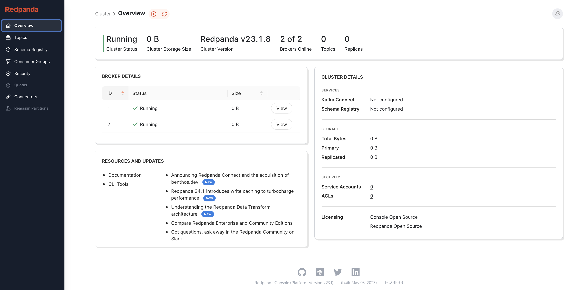

# FlinkAlgorithmicTrading

# Project: Realtime Algorithmic Trading 

## Overview
This project demonstrates a Algorithmic Trading with Flink using real-time market data processing system that integrates various components to process and analyze financial market data. The architecture leverages Apache Kafka and Redpanda for streaming data, Apache Flink and PyFlink for real-time data processing, and integrates with external APIs and Slack for live notifications.

## System Architecture

          +---------------+           +---------------+           +---------------+           +---------------+           +---------------+           +---------------+
          |  Market Data  |           |  Apache Kafka  |           |  Redpanda      |           |  Apache Flink  |           |  PyFlink       |           |  External APIs  |           |  Slack         |
          +---------------+           +---------------+           +---------------+           +---------------+           +---------------+           +---------------+           +---------------+
                  |                       |                       |                       |                       |                       |                       |                       |                       |
                  |                       |                       |                       |                       |                       |                       |                       |                       |
                  v                       v                       v                       v                       v                       v                       v                       v
          +---------------+           +---------------+           +---------------+           +---------------+           +---------------+           +---------------+           +---------------+
                  |  (Streaming)    |           |  (Streaming)    |           |  (Real-time)    |           |  (Python API)  |           |  (Integration)  |           |  (Live Notifications) |
          +---------------+           +---------------+           +---------------+           +---------------+           +---------------+           +---------------+           +---------------+
### Components

1. **Market Data Sources**
   - **Market News API**: Fetches real-time news related to financial markets.
   - **Historical Trade API**: Provides historical trading data for analysis.

2. **Data Streaming**
   - **Apache Kafka + Redpanda**: Utilized for data ingestion and streaming. Kafka collects data from various sources and streams it to Redpanda for further processing.

3. **Data Processing**
   - **Apache Flink**: Processes streaming data to generate insights and analytics.
   - **PyFlink**: A Python API for Apache Flink, enabling advanced analytics and machine learning on streaming data.

4. **Data Output**
   - **Live Market Trade API**: Streams processed trading data.
   - **Slack Notifications**: Sends real-time notifications of significant market events and anomalies.

### Workflow

1. **Data Ingestion**: Market News and Historical Trade data are ingested via APIs into the Kafka-Redpanda streaming platform.

2. **Streaming Processing**: Apache Flink and PyFlink process the incoming data stream to analyze and extract valuable insights.
3. **Output and Notifications**: The processed data is outputted to the Live Market Trade API and important events are notified through Slack.
